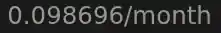

# rex-cat-eyes

- I found [tierhive](https://tierhive.com) and I didn't see a reason why I couldn't deploy a full Linux VPS that would provide a website with an https connection for less that $0.10/month. Turns out it works.

## tierhive

- I hit the `Contact Us` button to ask a few questions about the service and to my amazement, an actual human responded to me rather swiftly. 
- To make matters even more unlikely, it was an actual human that cared about open source and seemed to enjoy tinkering with computers. 
- [Tierhive](https://tierhive.com), depending upon how you configure it, can be shockingly cheap, but if I'm honest, knowing that it's run by people like me means that I would still prefer the service even if it were priced the same way other VPS providers are.
    - I have never seen another VPS provider that will allow you to configure:
        - RAM (Setting this above 2GB results in 2 vCPUs):
            - 128MB to 8GB
        - Fast Disk (NVMe):
            - 1GB to 100GB
        - CPU Priority:
            - Low -> Medium -> High
        - Disk IOPS:
            - Low -> Medium -> High
        - Network Throughput:
            - Low -> Medium -> High
        - **EPIC** OS Selection:
            - Alma Linux 8
            - Alma Linux 9
            - Alma Linux 10
            - Alma linux minimal 10
            - Alpine 3.22.2
            - Alpine 3.23.2
            - Arch Linux -Rolling release
            - Centos Stream 10
            - Centos Stream 09
            - Debian 12
            - Debian 13
            - Fedora Server 42
            - Fedora Server 43
            - FreeBSD using UFS 15.0
            - FreeBSD using ZFS 15.0
            - FreeBSD_unofficial UFS 14.2
            - FreeBSD_unofficial ZFS 14.2
            - No Operating System
            - 0penBSD 7.8
            - 0penSUSE 16
            - 0penSUSE 15.6
            - Rocky 8
            - Rocky 9
            - Rocky 10
            - Ubuntu 22.04
            - Ubuntu 24.04

## What's in here

- `cat-eyes/` - The directory that goes on the VPS's `/var/www/cat-eyes/`.
- `scripts/` - The script to do the inital server setup.
    - Amusingly, with 128MB of RAM:
        - Unless you clear the cache and provide swap space, you can't `apk update`.

## How to view it

**Go to [rex.tusko.org](https://rex.tusko.org)**

**Or**

**Scan the QR code**

## SVG

- Honestly, probably the most annoying part was getting the svg just right. (even though it's not actually just right, if you look closely, there are little dots above the eyes)
    - Find suitable image (would have been nice to start with an .svg) import it into `inkscape`.
    - Use `Path` -> `Trace Bitmap`
    - Select all the elements you don't want and delete them.
    - Clean it up as much as possible.
    - Place a layer underneath that layer.
    - Find the color you like and edit the attributes (like the `animation` effect).
    - Save as a plain .svg.

## SSL

- In order to get a valid SSL certificate you could do a few things. I chose to use the HAproxy service that [tierhive](https://tierhive.com) provides.
- Need the webpage to be up and reachable.
- Then you validate your domain using the TXT record that [tierhive](https://tierhive.com) provides. 
- Then you configure the A record with your DNS provider.
- Once [tierhive](https://tierhive.com) sees that you have a valid A record, you can setup an SSL certificate.
- There will be an icon, just click it, and be patient.
    - It took like 10 minutes for mine to be valid and working. The GUI console said it was in there and working right, but it wasn't properly deployed to all the HAproxy endpoints on the backend. **just be patient**

## License

I'm releasing this under the GNU AGPLv3 license. You're completely free to use, modify, and share this code. The only catch is that if you make changes or use it to run a service over the web, you have to keep your version open source under the same license too.

&nbsp;

**466f724a616e6574**